# Налаштування середовища

```text
(.venv) PS D:\neoversity\NoSQL\yusyp_nosql_3> docker-compose up -d
time="2026-05-31T15:59:01+03:00" level=warning msg="D:\\neoversity\\NoSQL\\yusyp_nosql_3\\docker-compose.yml: the attribute `version` is obsolete, it will be ignored, please remove it to avoid potential confusion"
[+] up 13/13
 ✔ Image neo4j:5.18-community      Pulled                                                                                                                                   18.1s
 ✔ Network yusyp_nosql_3_default   Created                                                                                                                                   0.0s
 ✔ Volume yusyp_nosql_3_neo4j_data Created                                                                                                                                   0.0s
 ✔ Volume yusyp_nosql_3_neo4j_logs Created                                                                                                                                   0.0s
 ✔ Container neo4j_movielens       Started 
```

# Частина 1 — проєктування схеми

### Опишіть схему графа: вузли (з лейблами та властивостями), типи ребер (з напрямком і властивостями). Поясніть логіку своїх рішень.

### 1. Які сутності стали вузлами, а які — ребрами? Чому?

Кожен користувач, фільм, рід занять, вік та жанр це окремий вузл. 

Користувач містить інформацію про себе, а саме: 
- ID
- стать 

Фільм містить інформацію про себе, а саме:
- ID
- Заголовок

Рід занять, вік та жанр вузли містять в собі інформацію таку ж як і називаються, наприклад жанр "пригоди", містить в собі інформацію "жанр: пригоди"

Ребра які йдуть від користувача до фільму містять таку інформаці:
- Оцінка
- Часова мітка

Ребра які йдуть від фільму до жанру, від користувача до роду занять та від користувача до віку - не містять додаткової інформації

Яка логіка такого розподілу:
1. Найважливіше, ми не дублююємо довгі назви професій, чи жарнів фільмів кожному фільму чи користувачу. Всого раз записаний і створений зв'язок.
2. Така структура сильно спрощує пошук, наприклад: ми можемо одразу побачити всіх користувачів певної вікової групи, через їх зв'язок з конкретним віковим вузлом і проаналізувати їх вподобання, чи наприклад як оцінюю програмісти мультфільми.

### 2. Оцінка користувача за фільм — це ребро (User)-[:RATED]->(Movie) чи окремий вузол (Rating)? Аргументуйте своє рішення. Це не риторичне запитання: в обох підходів є реальні trade-off-и.

Звичайно зручно було б якби оцінки були окремими вузлами, але оцінок всього 5, а користувачів понад 6 тис. і фільмів близько 4 тис.

З часом ці вузли стануть супервузлами і забиратимуть багато часу на пошук, потребуватимуть змін. Затримки в сучасному інформаційному середовищі неприпустимі і несуть невиправдано багато збитків. 

Коли оцінка є ребром, це спрощує обхід графа, наприклад в рекомендаційній системі пошук відбувається дуже швидко. Також запити виглядають більш природньо. Для статистики я б обрав оцінки як вузли, але як для оптимальної роботи сервісу - як ребра.

### 3. Чому жанри фільму вигідніше зберігати як окремі вузли (Genre), а не як список у властивості вузла Movie?

Всього 18 жанрів і 3'900 фільмів, очевидно що писати в кожному жанр не є оптимально, відповідно оптимальніше просто створити зв'язок 

# Частина 2 — Завантаження даних
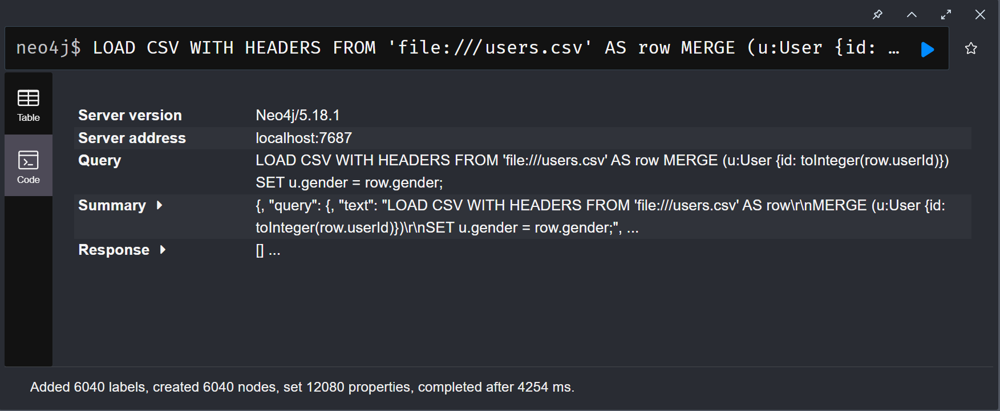
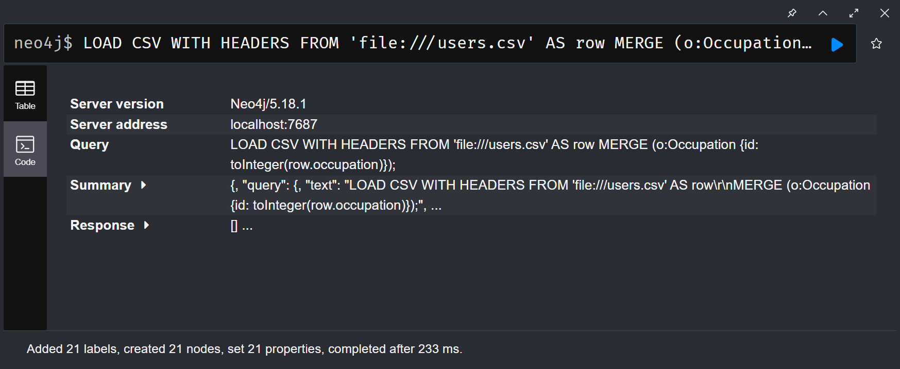
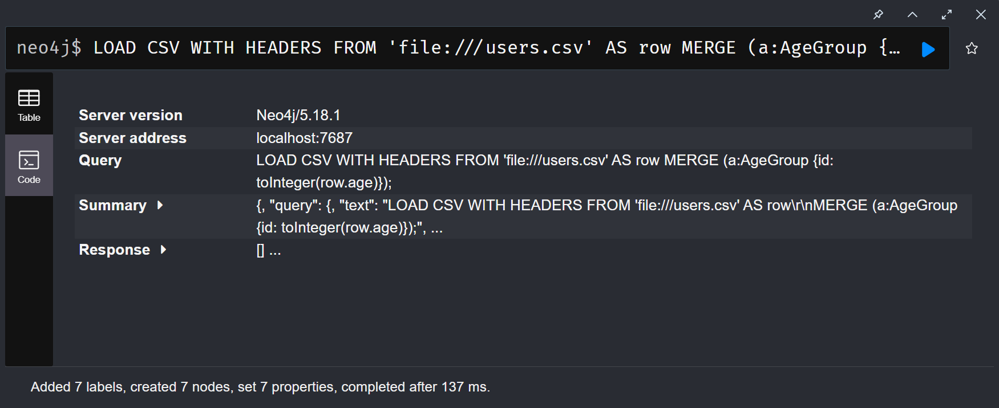
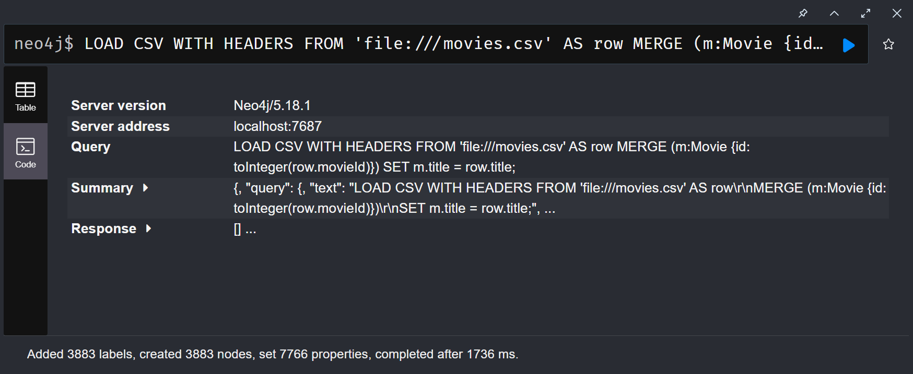
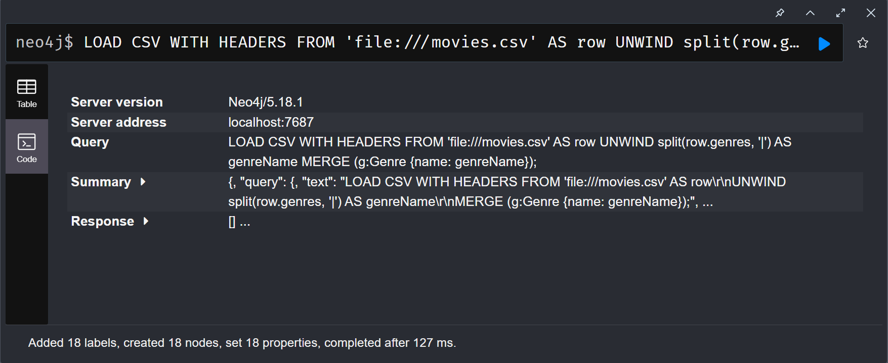

Даними запитами ми завантажили дані з таблиць і створили вузли. Ми використали MERGE щоб уникнути дублювання, також в запитах є SET, цією командою ми додаємо додаткову властивість вузлу. UNWIND та split() розпаковує да розділяє жанри, тому що фільми містять по декілька жанрів розділених |. UNWIND тут працює так само як в MongoDB. 

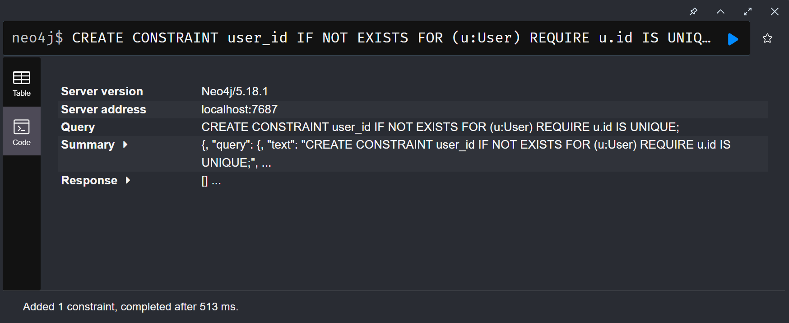
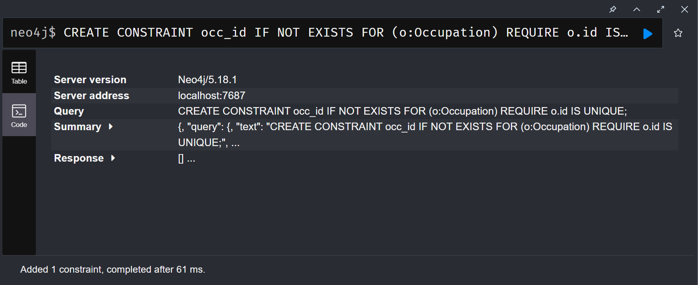
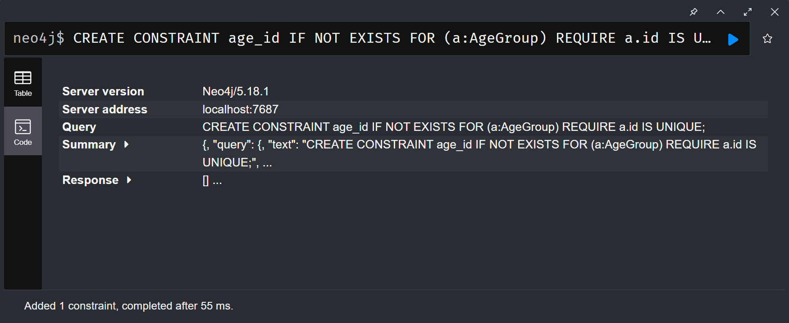
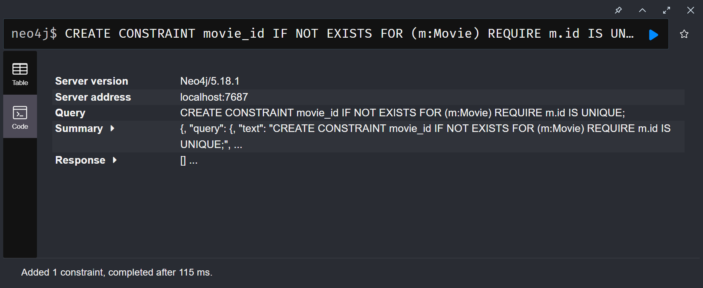
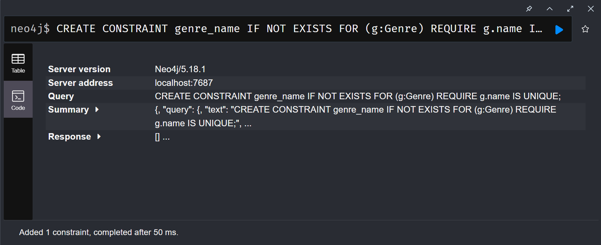

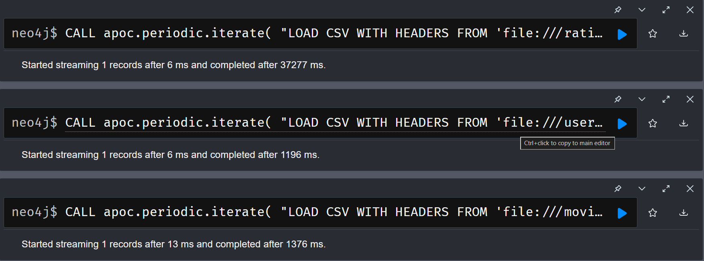

Перевірка результату:
```text
╒═══════╕
│ratings│
╞═══════╡
│1000209│
└───────┘

╒══════╕
│movies│
╞══════╡
│3883  │
└──────┘

╒═════╕
│users│
╞═════╡
│6040 │
└─────┘
```

# Частина 3 — Запити різної складності
```text
// Запит 1. Знайти всі фільми жанру «Thriller» із середнім рейтингом вище 4.0:
MATCH ()-[r:RATED]->(m:Movie)-[:BELONGS_TO]->(g:Genre {name: "Thriller"}) 
WITH m, avg(r.rating) AS avgRating
WHERE avgRating > 4
RETURN m.title, avgRating;
```

Запип 1: бере всі оцінені фільми які належать вузлу "Трилери", після чого рахує середнє всіх оцінок і їхню кількість, далі фільтрує за рейтингом де середнє більше 4, після чого виводить назву фільму та середній рейтинг

```text
// Запит 2. Знайти користувачів, які поставили оцінку 5 більш ніж 50 фільмам:
MATCH (p:User)-[r:RATED]->(m:Movie)
WHERE r.rating = 5
WITH p, count(r) AS ratedCount
WHERE ratedCount > 50
RETURN p.id, ratedCount;
```

Запит 2: бере всіх користувачів які поставили оцінки фільмам, потім фільтрує за оцінкою яка = 5, далі рахує кількість цих оцінок, і фільтрує де кількість цих оцінок перевище є, повертає користувача та кількість оцінок

```text
// Запит 3. Знайти фільми, які обидва користувачі (наприклад, userId=1 і userId=2) оцінили високо (рейтинг ≥ 4):
MATCH (u1:User {id: 1})-[r1:RATED]->(m:Movie)<-[r2:RATED]-(u2:User {id: 2})
WHERE r1.rating >= 4 AND r2.rating >= 4
RETURN m.title, u1.id, u2.id;
```

Запит 3: бере всі фільми які оцінили конкретні два користувача, фільтрує результат за оцінкою яка є не менша ніж 4, повертає назву фільму та користувачів що оцінили

```text
// Запит 4. Знайти жанри, чиї фільми стабільно отримують високі оцінки — середній рейтинг і кількість оцінок:
MATCH ()-[r:RATED]->(m:Movie)-[:BELONGS_TO]->(g:Genre)
WITH avg(r.rating) AS avgRating, count(r) AS countRating, g
WHERE avgRating >= 4 AND countRating >= 50
RETURN g.name AS genreName, avgRating, countRating;
```

Запит 4: бере всі фільми які мають оцінки і належать певним жанрам, рахує середнє всіх оцінок і кількість цих оцінок, фільтрує за середнім рейтингом не менше як 4 і кількістю оцінок не менше як 50, повертає жанри, середній рейтинг і кількість оцінок

```text
// Запит 5. Рекомендація «користувачі зі схожими смаками також дивилися»: для заданого користувача знайти фільми, 
// які він ще не дивився, але високо оцінили користувачі з подібними смаками:
MATCH (u1:User {id: 1})-[r1:RATED]->(m:Movie)<-[r2:RATED]-(u2:User)
WHERE r1.rating = 5 AND r2.rating = 5 AND u2 <> u1
WITH u1, u2, count(m) AS commonFilmCount
WHERE commonFilmCount >= 15
MATCH (u2)-[r3:RATED]->(rec:Movie)
WHERE r3.rating = 5 AND NOT (u1)-[:RATED]->(rec)
RETURN DISTINCT u1.id AS userId, rec.id AS filmId, rec.title AS filmName;
```

Запит 5: бере фільми які дивився користувач1 і користувач2, фільтрує фільми за оцінкою 5 і виключає можливість що користувач1 це користувач2, рахує кількість фільмів і фільтрує за кількістю спільних фільмів не менше як 15, далі бере користувача2 і всі фільми які він оцінив, відсікаємо фільми оцінка яких менша 5 і які не оцінював користувач1, повертаємо користувача1, ID фільму та назву фільму, виключаючи дублікати через DISTINCT

```text
// Запит 6. Знайти найкоротший ланцюжок зв’язку між двома користувачами
// через спільні фільми:
MATCH (u1:User {id: 1}), (u2:User {id: 2})
MATCH path = shortestPath((u1)-[:RATED*]-(u2))
WHERE ALL(
    n IN nodes(path)[1..-1]
    WHERE 'Movie' IN labels(n) OR 'User' IN labels(n)
)
RETURN path, length(path);
```

Запит 6: бере двох користувачів, зв'язок яких будемо шукати, далі через вбудовану функцію cypher shortestPath шукаємо найкоротший шлях через оцінку фільму, далі перевіряємо чи не порапив шлях вузл якого ми не оцічуємо і відсікаємо його якщо такий є, повертаємо шлях і його довжину

### Що означає довжина шляху в даному контексті?

Довжина шляху в даному контексті це кількість ребер через які треба пройти щоб дістатись кінцевої точки. Якщо ребра зважені, то довжина шляху буде сума ваг ребер.

### Один хоп — це один крок по ребру RATED, а значить — шлях довжини 2 означає, що два користувачі оцінили один і той самий фільм.

Так, адже якщо шукати шлях до іншого користувача, у нашій базі немає зв'язку напряму від користувача до користувача, і відповідно роблячи це через фільм, ми беремо оцінки одного фільму двох користувачів. 

### Як інтерпретувати шлях довжини 4? Довжини 6?

Шлях довжини 4 виглядає приблизно так Користувач-->Фільм<--Користувач-->Фільм<--Користувач. Тут ми бачимо 4 ребра, відповідно це і є шлях довжини 4. Для довжини 6 до цього ланцюжка просто додаємо -->Фільм<--Користувач.

# Частина 4 — Виявлення супервузлів
```text
// Крок 1. Знайдіть вузли з аномально великою кількістю ребер:
MATCH (n)
WITH n, COUNT { (n)--() } AS degree
WHERE degree > 1000
RETURN labels(n), n.id, degree
ORDER BY degree DESC;
```

Запит: бере всі вузли, рахує кількість їх ребер, відсіює вузли кількість ребер яких менша за 1000, повертає назву вузла, його Id та кількість ребер, відсортовує результат у зворотньому порядку.

### 1. Які вузли виявилися супервузлами? Скільки у них зв’язків?

Для демонтрації відповіді на наде запитання беремо ТОП 3 результату 
```text
╒════════════╤════╤══════╕
│labels(n)   │n.id│degree│
╞════════════╪════╪══════╡
│["Movie"]   │2858│3430  │
├────────────┼────┼──────┤
│["Movie"]   │260 │2995  │
├────────────┼────┼──────┤
│["Movie"]   │1196│2995  │
├────────────┼────┼──────┤
```

### 2. Чому запит, що зачіпає такий вузол, працює повільніше, ніж запит по «звичайному» вузлу з тими самими індексами?

Тому що індекси допомагають знайти вузли, саме вузли і є індексовані, а не ребра, відповідно коли запит потрапляє на супервузол, він змушений перебирати велетенську кількість ребер щоб знайти куди рухатись далі.

### 3. Яку конкретну стратегію з лекцій ви б застосували для цього датасету? (Підказка: подивіться на жанрові вузли — вони теж супервузли?) Що з ними робити?

Два вузли з жанрів виявились супервузлами. 

```text
╒═════════╤════╤══════╕
│labels(n)│n.id│degree│
╞═════════╪════╪══════╡
│["Genre"]│null│1603  │
├─────────┼────┼──────┤
│["Genre"]│null│1200  │
└─────────┴────┴──────┘
```

Я б застосував стратегію денормалізації критичних даних для цієї ситуації, і зберігав би кількість кількість фільмів з цим жанром як властивість вузла

# Частина 5 — Графові алгоритми через GDS

## 5.2. Виявлення спільнот (Louvain)

### 1. Чи відповідають отримані кластери інтуїтивним групам (наприклад, «любителі бойовиків», «цінителі арт-хаусу»)?

### 2. Як ви це перевірили?

## 5.3. Найкоротший шлях між користувачами

### 1. Наскільки «тісний світ» у цьому датасеті? Спробуйте кілька пар користувачів.

### 2. Яка середня довжина шляху? Чи підтверджується гіпотеза «шести рукостискань»?

# Частина 6 — Аналіз і висновки

### 1. Граф vs SQL. Які із запитів частини 3 було б складно або неможливо написати в SQL? Чому? Наведіть конкретний приклад — покажіть, як виглядав би еквівалентний SQL-запит (або поясніть, чому його не існує).

### 2. Де граф програє? Для яких задач із цим датасетом реляційна модель підійшла б краще? Наприклад: агрегація по всіх користувачах, звіти, експорт даних.

### 3. Покращення схеми. Які зміни в схемі прискорили б конкретні запити з частини 3? Розгляньте хоча б два запити.
